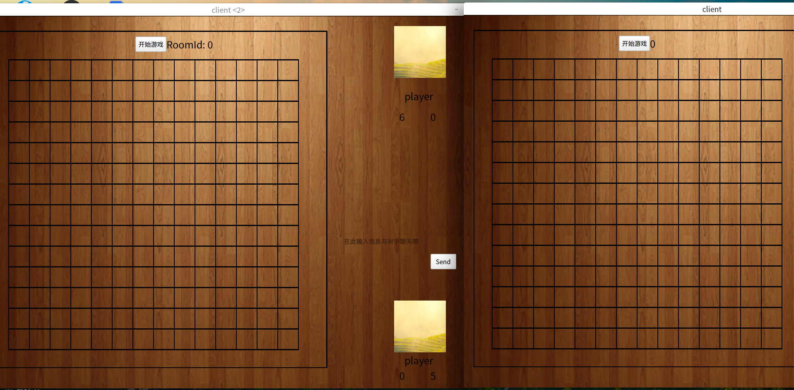
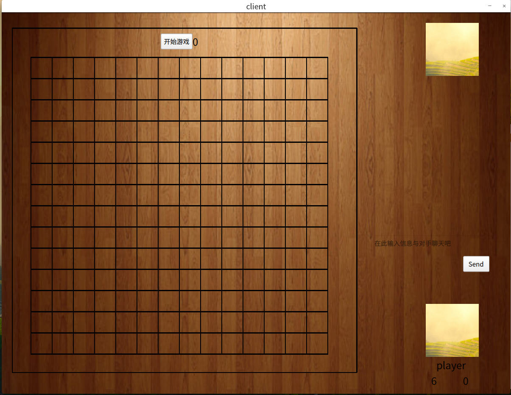
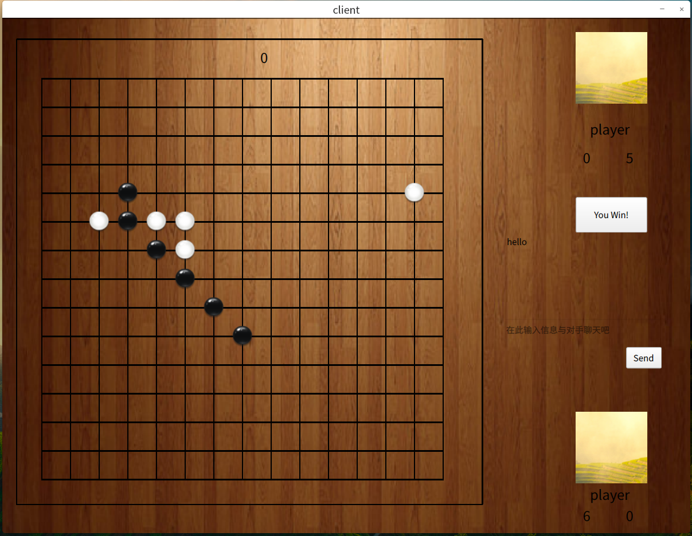

# Qt_Wzq
* Linux Qt
* 基于Linux 和 Qt 的联机五子棋游戏。创建-加入房间的玩法，支持游戏房间内聊天。
* 服务端：基于Linux 环境 Socket网络编程，采用Epoll模型。数据库使用MySql存储用户信息。
* 客户端：基于Linux 环境 使用 Qt 框架编写游戏界面，采用多线程编程，主窗体向服务端发送信息，新建线程用来阻塞循环监听接收服务端信息。

